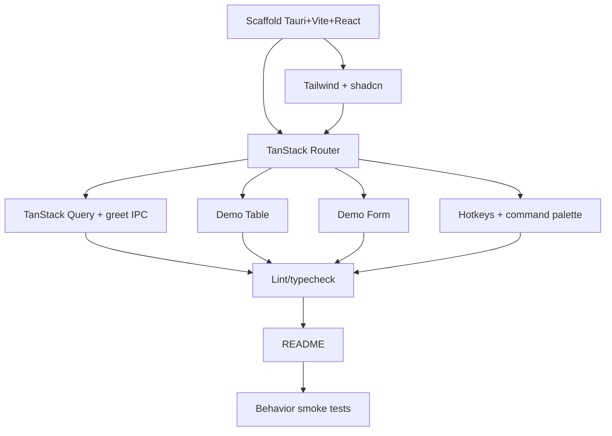

# Plan: Bootstrap - Tauri + React + TanStack Scaffold

**Spec:** docs/features/20260619195231-bootstrap/spec.md
**Created:** 2026-06-19
**Estimated Effort:** ~0.5-1 day
**Status:** Implemented (verified; awaiting user validation before commit)

## 1. Overview

Create a runnable empty desktop app: Tauri 2 shell + Vite/React 19/TS frontend, wired
with TanStack Router/Query/Table/Form, `@tanstack/react-hotkeys` keybindings, and
shadcn/ui + Tailwind v4. Each TanStack lib proven with a minimal demo. No product
features. Mirrors the sibling `requi` bootstrap so both projects share one structure.

## 2. Task Breakdown

| # | Task | Spec Ref | Files | Type | Estimate |
|---|------|----------|-------|------|----------|
| 1 | Scaffold Vite + React + TS + Tauri 2 (`npm create tauri-app`) | AC-001, AC-002 | `package.json`, `vite.config.ts`, `src-tauri/**`, `index.html`, `.nvmrc`, `tsconfig*.json` | impl | 1h |
| 2 | Add Tailwind v4 + init shadcn/ui, add Button | AC-008 | `src/index.css`, `components.json`, `src/components/ui/button.tsx`, `vite.config.ts` | impl | 1h |
| 3 | Wire TanStack Router: root layout + `/` + `/settings` + 404 | AC-003 | `src/router.tsx`, `src/routes/**`, `src/main.tsx` | impl | 1h |
| 4 | Wire TanStack Query: `QueryClientProvider` + `greet` Tauri command + demo query | AC-004, AC-011 | `src-tauri/src/lib.rs`, `src/lib/tauri.ts`, `src/app/providers.tsx`, `src/routes/index.tsx` | impl | 1.5h |
| 5 | Demo TanStack Table (placeholder result-grid rows) | AC-005 | `src/components/demo-table.tsx` | impl | 0.5h |
| 6 | Demo TanStack Form (one validated field + submit) | AC-006 | `src/components/demo-form.tsx` | impl | 0.5h |
| 7 | Global keybinding (`Mod+K`) via TanStack Hotkeys → command-palette placeholder | AC-007 | `src/components/command-palette.tsx`, `src/app/providers.tsx` | impl | 0.5h |
| 8 | Lint + typecheck + scripts (`start`, `dev`, `build`, `lint`, `typecheck`, `format`, `test`) | AC-010 | `package.json`, `eslint.config.js`, `.prettierrc.json` | impl | 0.5h |
| 9 | README run instructions + prerequisites + repo layout | AC-009, deps | `README.md` | impl | 0.5h |
| 10 | Behavior smoke tests for TC-001..TC-004 + table/form | AC-002..007 | `src/**/__tests__/*.test.tsx`, `tests/e2e/bootstrap.spec.tsx`, `src/test/setup.ts`, `vitest.config.ts` | test | 1h |

## 3. Execution Order



## 4. TDD Strategy

Scaffold work is mostly config, so strict RED-first is impractical for tasks 1-2.
Apply TDD where behavior exists (routing, query, table, form, hotkey).

### RED Phase
- A fresh test-writer subagent writes failing behavior tests for TC-001..TC-004 plus
  table/form rendering, against expected component contracts, before wiring them.

### GREEN Phase
- Implement each demo until its test passes. Minimal code, no speculative branches.

### REFACTOR Phase
- Extract shared layout, query client, and providers into `src/app/` once duplicated.

## 5. File Changes

### New Files
- `package.json`, `vite.config.ts`, `index.html`, `.nvmrc`, `tsconfig.json`, `tsconfig.node.json` — frontend tooling
- `src-tauri/` (`Cargo.toml`, `tauri.conf.json`, `build.rs`, `src/lib.rs`, `src/main.rs`, `capabilities/`, `icons/`) — desktop shell with `greet` command
- `src/main.tsx`, `src/router.tsx`, `src/app/providers.tsx` — app entry + providers
- `src/routes/{__root,index,settings}.tsx` — layout + 404, home, settings
- `src/lib/tauri.ts` — typed `invoke` wrappers
- `src/lib/utils.ts` — `cn` helper (shadcn)
- `src/components/{demo-table,demo-form,command-palette}.tsx`, `src/components/ui/button.tsx` — demos + shadcn
- `src/index.css`, `components.json` — styling + shadcn config
- `eslint.config.js`, `.prettierrc.json` — lint/format
- `src/test/setup.ts`, `vitest.config.ts` — test harness
- `src/**/__tests__/*.test.tsx`, `tests/e2e/bootstrap.spec.tsx` — behavior smoke tests
- `README.md` — run instructions (replaces current stub)

### Modified Files
- `docs/adr.md` — log stack + IPC-demo decisions
- `docs/learnings.md` — any setup gotchas (Tailwind v4 / shadcn / hotkeys alpha)

## 6. Dependencies

### Must Complete First
- Task 1 (scaffold) blocks everything.

### Can Parallelize
- Tasks 5 (Table), 6 (Form), 7 (Hotkeys) are independent once Router (T3) exists.

## 7. Risks and Mitigations

| Risk | Impact | Mitigation |
|------|--------|------------|
| Tailwind v4 + shadcn config churn (v4 dropped `tailwind.config`) | Setup friction | Follow current shadcn "Tailwind v4 + Vite" guide; copy working setup from requi |
| TanStack Router file-based vs code-based | Rework | Code-based routes (mirror requi) - fewer build plugins |
| TanStack Hotkeys is young | API churn | Pin version; isolate behind `command-palette.tsx` |
| Tauri OS prerequisites missing | `tauri dev` fails | Document in README; verify `rustc`/`cargo` before build |
| Driving a real Tauri window in E2E is heavy/flaky | Slow CI | Behavior tests in Vitest + RTL with mocked `invoke`; defer real tauri-driver E2E |
| Pulling versions blind drifts from requi | Inconsistent stack | Reuse requi's pinned versions as the baseline |

## 8. Acceptance Verification

| AC ID | Criterion | Test(s) | Status |
|-------|-----------|---------|--------|
| AC-001 | Clean install | `npm install` (309 pkgs, no peer errors); `npm ci --dry-run` clean | PASS |
| AC-002 | Dev window launches | cargo compile + frontend build proxy (GUI not launched) | PASS (proxy) |
| AC-003 | Routing + nav + 404 | "should navigate between routes…", "should render a not-found view…" | PASS |
| AC-004 | Query app-wide + demo resolves | "should resolve a query backed by a Tauri command…", "…loading indicator…", "…inline error…when the greet command rejects" | PASS |
| AC-005 | Demo table renders | "should render a demo table with column headers and rows", "…empty state when…no rows" | PASS |
| AC-006 | Demo form renders + validates | "should show a validation error and not confirm submit…" | PASS |
| AC-007 | Global hotkey | "should toggle the command palette dialog on the Mod+K hotkey" | PASS |
| AC-008 | shadcn Button styled | "should render home route with heading and a button on launch" + CSS build | PASS |
| AC-009 | Build succeeds | `npm run build` (vite, 252 modules); cargo compile (native bundle not run) | PASS (proxy) |
| AC-010 | Lint + typecheck pass | `npm run lint` (0 errors, 1 accepted warning), `npm run typecheck` exit 0 | PASS |
| AC-011 | `greet` IPC callable | cargo `should_greet_*` (2) + frontend greeting query test | PASS |
```
